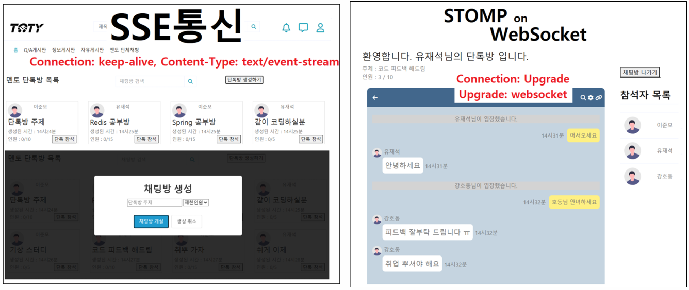

# Toy 단체 채팅
## Stomp on Websocket 과 SSE를 통한 실시간 데이터 처리
<div>
   
</div>

### 디렉토리 구조

```
├─chatting
│  ├─application
│  ├─domain
│  └─presentation
├─common
├─springconfig
└─user
```
### 채팅방 종료 기능 : [MentorService.java](https://github.com/doriver/chatting02/blob/master/src/main/java/com/exercise/chatting02/chatting/application/MentorService.java#L66)

### 샘플 화면
<div>
  
</div>
